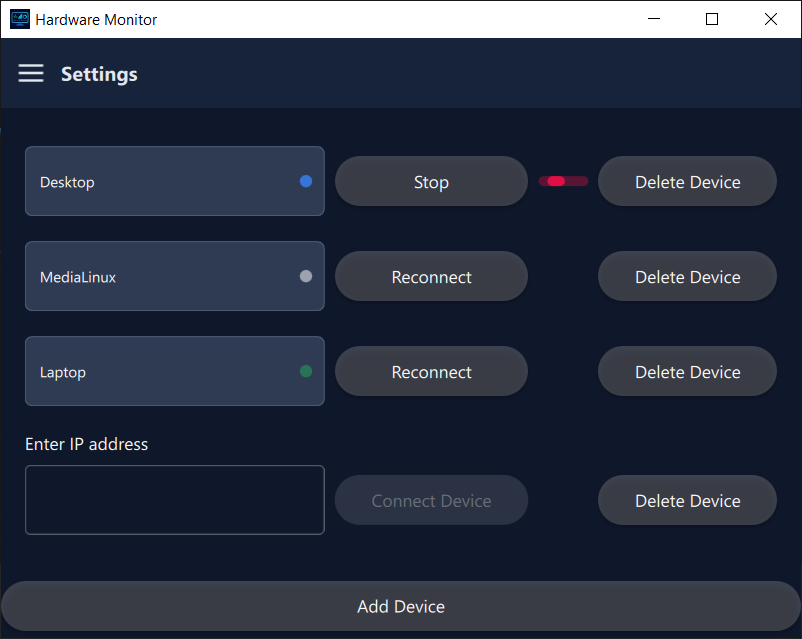
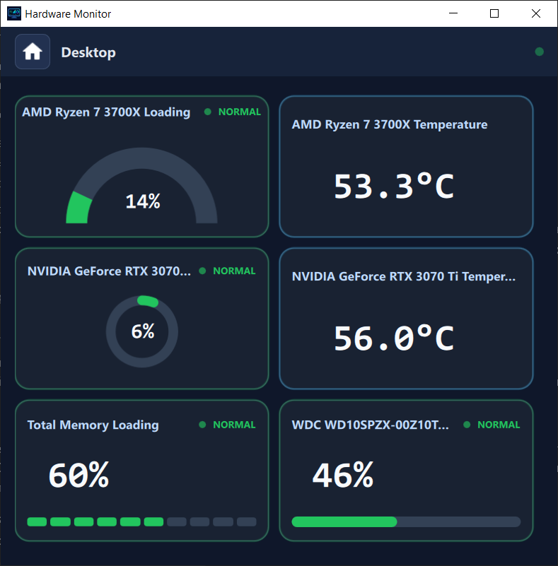
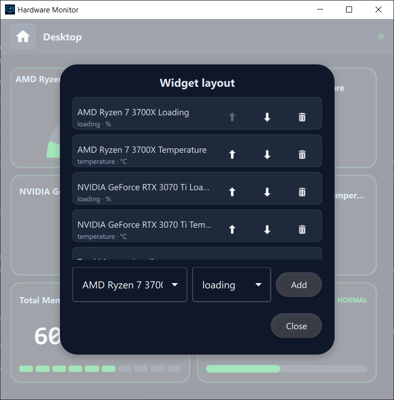
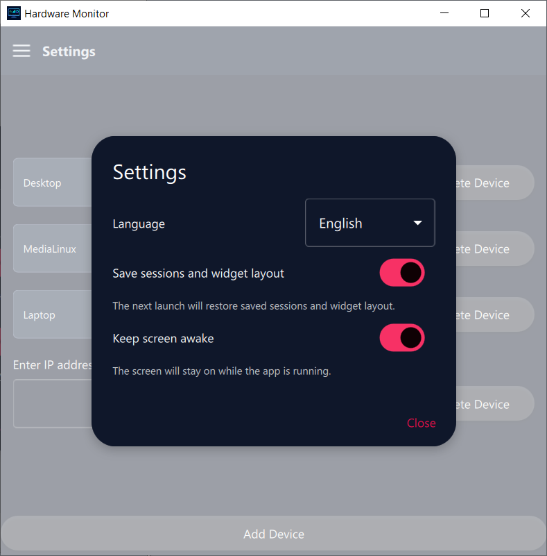

# HWFrontQML

**Language:** [Русский](README.md) | English

**HWFrontQML** is a Qt/QML application for monitoring hardware metrics from remote devices. The application lets you add devices by IP address, connect to metric sources on Windows and Linux, view available metrics on a customizable dashboard, and persist session state between launches.

**Current version:** `1.5.0`.

## Contents

- [Features](#features)
- [Screenshots](#screenshots)
- [Technology stack](#technology-stack)
- [Project structure](#project-structure)
- [Requirements](#requirements)
- [Build and run](#build-and-run)
- [Using the application](#using-the-application)
- [Settings and state persistence](#settings-and-state-persistence)
- [CI/CD](#cicd)

## Features

- Add multiple devices and manage separate connection sessions.
- Enter an IPv4 address with basic validation in the UI.
- Display the state of each session: idle, connecting, connected, or error.
- Open a dedicated dashboard page for every connected device.
- Connect to Windows metric sources based on [LibreHardwareMonitor](https://github.com/LibreHardwareMonitor/LibreHardwareMonitor) instead of the legacy OpenHardwareMonitor path.
- Support Linux metric sources through the hardware monitoring adapter.
- Automatically discover available device metrics through `HWConnector` and the shared `HardwareMonitorContract`.
- Show CPU, GPU, RAM, and battery metrics on the dashboard when the device provides them.
- Show metrics as cards with selectable display variants, including segmented, ring, and arc progress views.
- Configure the dashboard widget set and ordering: add, remove, and reorder metric cards.
- Rename devices with a custom alias.
- Optionally persist sessions, device aliases, and dashboard widget layouts between launches.
- Switch the interface language between Russian and English.
- Enable **Keep screen awake** mode while monitoring.
- Prepare a Windows Release deployment folder with `windeployqt`.

## Screenshots

### Start screen, device list, and connection states



### Metrics dashboard



### Widget layout settings



### General settings



## Technology stack

- **C++17** for the core application logic.
- **Qt 6** with `Core`, `Gui`, `Quick`, and `Qml`.
- **QML / Qt Quick Controls 2** for the user interface.
- **CMake** for build configuration.
- **Git submodules** for `HWConnector` and `HardwareMonitorContract`.
- **GitHub Actions** for automated Windows Release builds.

## Project structure

```text
.
├── android/                 # Android package source directory for Qt builds
├── icons/                   # Application and UI icons
├── qml/                     # QML user interface
│   ├── components/          # Reusable screen components
│   ├── controls/            # Custom UI controls
│   ├── dialogs/             # Settings, alias, and layout dialogs
│   ├── pages/               # Main application pages
│   └── main.qml             # Root window and navigation
├── src/
│   ├── app/                 # Application entry point
│   ├── core/                # Sessions, state, and metrics service
│   ├── lhmparser/           # LibreHardwareMonitor data parser
│   ├── linuxadapter/        # Linux metric source parser
│   └── models/              # Models exposed to QML
├── translations/            # UI translation files
├── HWConnector/             # Metric source connection submodule
├── HardwareMonitorContract/ # Shared hardware snapshot contract submodule
├── CMakeLists.txt           # Build configuration
├── qml.qrc                  # QML and resources embedded into the app
└── .github/workflows/       # CI workflows
```

## Requirements

For a local build, install:

- Git.
- CMake 3.16 or newer.
- A compiler with C++17 support.
- Qt 6 with the `Core`, `Gui`, `Quick`, and `Qml` modules.
- Access to the submodule repositories:
  - [`HWConnector`](https://github.com/Xipypr/HWConnector)
  - [`HardwareMonitorContract`](https://github.com/Xipypr/HardwareMonitorContract)
- A running [LibreHardwareMonitor](https://github.com/LibreHardwareMonitor/LibreHardwareMonitor) instance with **Remote Web Server** enabled and its port open to the device running HWFrontQML.
- A compatible Linux adapter that exposes a hardware snapshot in the project format, with its port open to the device running HWFrontQML.

> If the submodule directories are empty, CMake will try to initialize them automatically. If the repositories are private, configure Git authentication before building.

## Build and run

### 1. Clone the repository

```bash
git clone --recurse-submodules <repository-url>
cd HWFrontQML
```

If the repository was cloned without submodules:

```bash
git submodule update --init --recursive
```

### 2. Debug build for development

```bash
cmake -S . -B build -DCMAKE_BUILD_TYPE=Debug
cmake --build build
```

The executable path depends on the platform and the CMake generator. For single-configuration generators, for example:

```bash
./build/HWFrontQML
```

### 3. Release build

```bash
cmake -S . -B build-release -DCMAKE_BUILD_TYPE=Release
cmake --build build-release --config Release
```

On Windows, a Release build creates a `deploy/` directory by default. It contains the executable, Qt runtime dependencies, and submodule dynamic libraries when they are built as shared libraries.

To disable automatic deployment:

```bash
cmake -S . -B build-release -DCMAKE_BUILD_TYPE=Release -DHWFRONTQML_DEPLOY_AFTER_BUILD=OFF
```

To choose another deployment directory:

```bash
cmake -S . -B build-release -DCMAKE_BUILD_TYPE=Release -DHWFRONTQML_DEPLOY_DIR=/path/to/deploy
```

### 4. Build with shared dependencies

Dependencies are built statically by default. To build them as shared libraries, use the standard CMake option:

```bash
cmake -S . -B build-release -DCMAKE_BUILD_TYPE=Release -DBUILD_SHARED_LIBS=ON
cmake --build build-release --config Release
```

## Using the application

1. Start the application.
2. On the start screen, click **Add Device**.
3. Enter the target device IPv4 address.
4. Wait for the connection to complete and the device card to appear.
5. Click the connected device to open the dashboard page.
6. Use the device page header to open device settings.
7. In device settings, you can:
   - set a device alias;
   - open the widget layout dialog;
   - add, remove, or reorder metric cards.

## Settings and state persistence

The general settings dialog includes the **Save sessions and widget layout** switch.

When persistence is enabled, the application restores the following data on the next launch:

- saved sessions;
- device addresses;
- device aliases;
- dashboard widget set and order;
- selected metric card display variants.

When persistence is disabled, the saved state is cleared and the next launch starts with an empty device list.

## CI/CD

The repository includes a GitHub Actions workflow for Windows Release builds:

- it can be started manually with `workflow_dispatch`;
- it runs on pushes of tags matching `v*`;
- it installs Qt 6.8.3;
- it builds the project in Release configuration;
- it validates that the `deploy/` directory exists;
- it publishes a build artifact;
- for `v*` tags, it packs `deploy/` into a zip archive and attaches it to a GitHub Release.

CI access to private submodules requires a repository secret named `SUBMODULES_TOKEN` with read access to the contents of `Xipypr/HWConnector` and `Xipypr/HardwareMonitorContract`.

## Useful CMake options

| Option | Default value | Description |
| --- | --- | --- |
| `BUILD_SHARED_LIBS` | `OFF` | Build dependencies as shared libraries instead of static libraries. |
| `HWFRONTQML_DEPLOY_AFTER_BUILD` | `ON` for Release | Create a deployment folder after a Windows Release build. |
| `HWFRONTQML_DEPLOY_DIR` | `<repo>/deploy` | Directory for the runnable application bundle. |

## Notes

- Automatic deployment currently targets Windows and uses `windeployqt`.
- Deployment is disabled automatically for non-Release builds.
- Windows device monitoring targets LibreHardwareMonitor; OpenHardwareMonitor is no longer the primary integration path.
- The Android package source directory is located in `android/`; actual Android builds depend on an installed Qt for Android toolchain.
