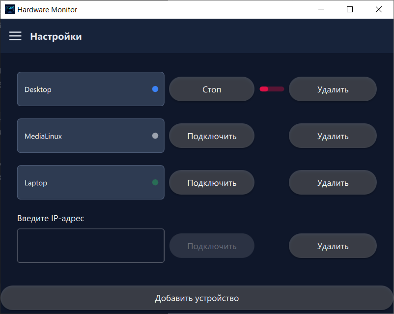
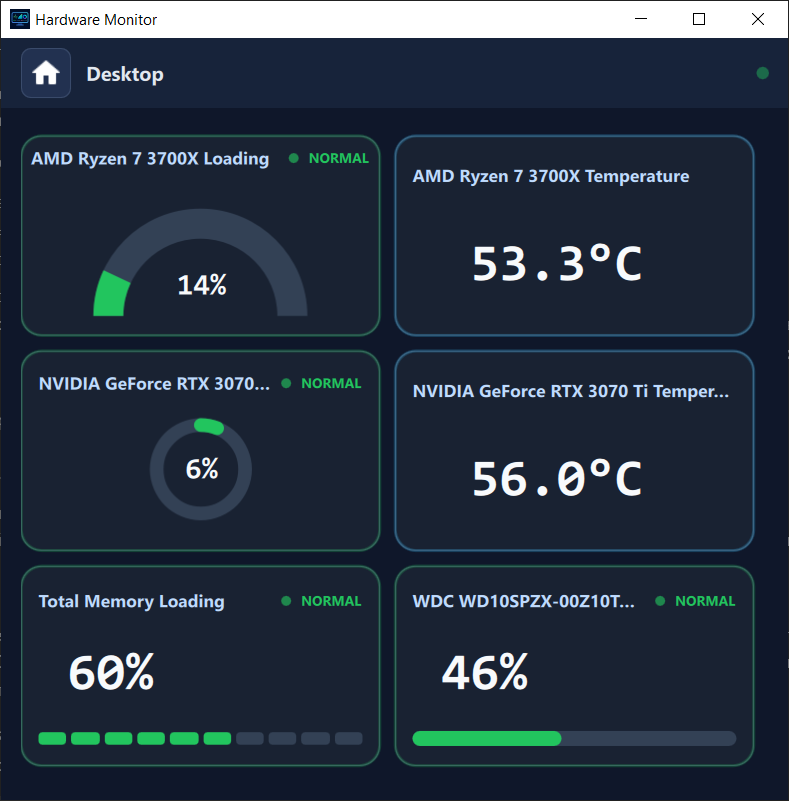
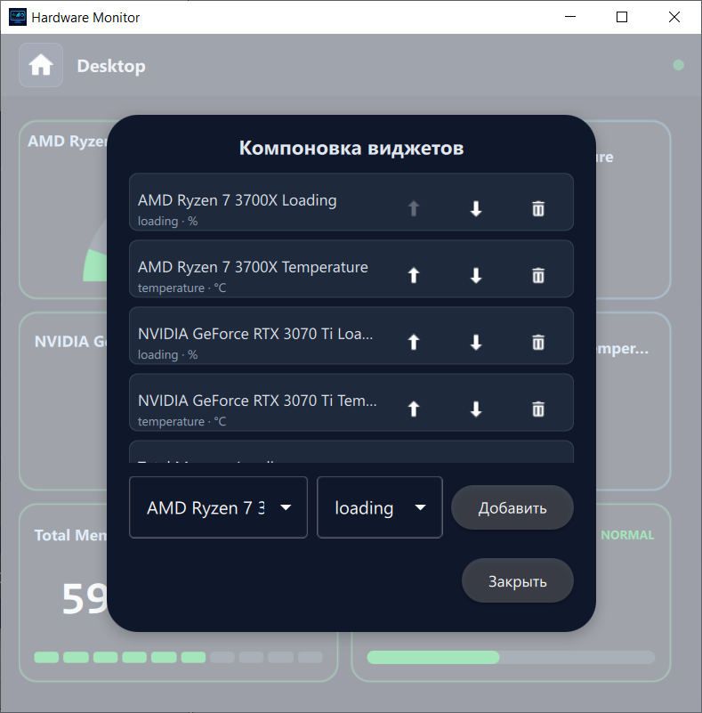
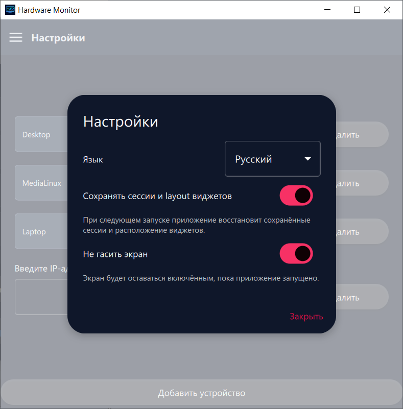

# HWFrontQML

**Язык:** [English](README.md) | Русский

**HWFrontQML** — Qt/QML-приложение для мониторинга аппаратных метрик удалённых устройств. Приложение позволяет добавлять устройства по IP-адресу, подключаться к источникам метрик на Windows и Linux, просматривать доступные показатели в виде настраиваемой панели мониторинга и сохранять состояние сессий между запусками.

**Текущая версия:** `1.6.0`.

## Содержание

- [Возможности](#возможности)
- [Скриншоты](#скриншоты)
- [Технологии](#технологии)
- [Структура проекта](#структура-проекта)
- [Зависимости](#зависимости)
- [Сборка и запуск](#сборка-и-запуск)
- [Работа с приложением](#работа-с-приложением)
- [Настройки и сохранение состояния](#настройки-и-сохранение-состояния)
- [CI/CD](#cicd)

## Возможности

- Добавление нескольких устройств и управление отдельными сессиями подключения.
- Ввод IPv4-адреса устройства с базовой валидацией на стороне интерфейса.
- Отображение статуса каждой сессии: ожидание, подключение, активное соединение или ошибка.
- Отдельная страница панели мониторинга для каждого подключённого устройства.
- Подключение к Windows-источникам на базе [LibreHardwareMonitor](https://github.com/LibreHardwareMonitor/LibreHardwareMonitor) вместо устаревшего OpenHardwareMonitor.
- Поддержка Linux-источника метрик через [LinuxHardwareDaemon](https://github.com/Xipypr/LinuxHardwareDaemon).
- Автоматическое обнаружение доступных метрик устройства через `HWConnector` и общий контракт `HardwareMonitorContract`.
- Панель мониторинга с метриками CPU, GPU, RAM, накопителей, батареи и сети, когда такие показатели доступны на устройстве.
- Мониторинг скорости загрузки и отдачи сети в общей карточке с вертикальным и горизонтальным вариантами расположения.
- Карточки метрик с переключаемым вариантом отображения, включая сегменты, кольца и дуги прогресса.
- Настройка состава и порядка виджетов панели мониторинга: можно добавлять, удалять и перемещать карточки.
- Переименование устройства через пользовательский псевдоним.
- Опциональное сохранение списка сессий, псевдонимов устройств и расположения виджетов между запусками.
- Переключение языка интерфейса между русским и английским.
- Режим **«Не гасить экран»**, чтобы экран не засыпал во время мониторинга.
- Подготовка папки поставки для Windows-сборок в конфигурации Release через `windeployqt`.

## Скриншоты

### Стартовый экран, список устройств и подключение



### Панель мониторинга метрик



### Настройка расположения виджетов



### Общие настройки



## Технологии

- **C++17** — основная логика приложения.
- **Qt 6** — `Core`, `Gui`, `Quick`, `Qml`.
- **QML / Qt Quick Controls 2** — интерфейс приложения.
- **CMake** — конфигурация сборки.
- **Git-подмодули** — подключение библиотек `HWConnector` и `HardwareMonitorContract`.
- **GitHub Actions** — автоматическая Windows-сборка в конфигурации Release.

## Структура проекта

```text
.
├── android/                 # Исходные файлы Android-пакета для Qt-сборки
├── icons/                   # Иконки приложения и интерфейса
├── qml/                     # QML-интерфейс
│   ├── components/          # Переиспользуемые компоненты экранов
│   ├── controls/            # Пользовательские элементы управления
│   ├── dialogs/             # Диалоги настроек, псевдонимов и расположения виджетов
│   ├── pages/               # Основные страницы приложения
│   └── main.qml             # Корневое окно и навигация
├── src/
│   ├── app/                 # Точка входа приложения
│   ├── core/                # Сессии, состояние, сервис метрик
│   ├── lhmparser/           # Парсер данных LibreHardwareMonitor
│   ├── linuxadapter/        # Парсер Linux-источника метрик
│   └── models/              # Модели для QML
├── translations/            # Файлы переводов интерфейса
├── HWConnector/             # Подмодуль сетевого подключения к источникам метрик
├── HardwareMonitorContract/ # Подмодуль общего контракта аппаратных снимков
├── CMakeLists.txt           # Описание сборки
├── qml.qrc                  # QML и ресурсы, встраиваемые в приложение
└── .github/workflows/       # CI-сценарии
```

## Зависимости

Для локальной сборки нужны:

- Git.
- CMake 3.16 или новее.
- Компилятор с поддержкой C++17.
- Qt 6 с модулями `Core`, `Gui`, `Quick`, `Qml`.
- Доступ к репозиториям подмодулей:
  - [`HWConnector`](https://github.com/Xipypr/HWConnector)
  - [`HardwareMonitorContract`](https://github.com/Xipypr/HardwareMonitorContract)
- Для мониторинга Windows-устройства нужен запущенный [LibreHardwareMonitor](https://github.com/LibreHardwareMonitor/LibreHardwareMonitor) с включённым **Remote Web Server** и портом, открытым для подключения с устройства, на котором запущен HWFrontQML.
- Для мониторинга Linux-устройства нужен запущенный [LinuxHardwareDaemon](https://github.com/Xipypr/LinuxHardwareDaemon), отдающий аппаратные снимки, с портом, открытым для подключения с устройства, на котором запущен HWFrontQML.

> Если директории подмодулей пустые, CMake попытается инициализировать их автоматически. При отсутствии доступа к приватным репозиториям выполните настройку авторизации Git заранее.

## Сборка и запуск

### 1. Клонирование репозитория

```bash
git clone --recurse-submodules https://github.com/Xipypr/HWFrontQML.git
cd HWFrontQML
```

Если репозиторий уже склонирован без подмодулей:

```bash
git submodule update --init --recursive
```

### 2. Сборка Debug для разработки

```bash
cmake -S . -B build -DCMAKE_BUILD_TYPE=Debug
cmake --build build
```

Запуск исполняемого файла зависит от платформы и используемого генератора CMake. Например, для одно-конфигурационных генераторов:

```bash
./build/HWFrontQML
```

### 3. Сборка Release

```bash
cmake -S . -B build-release -DCMAKE_BUILD_TYPE=Release
cmake --build build-release --config Release
```

На Windows сборка Release по умолчанию дополнительно создаёт папку `deploy/` с исполняемым файлом, зависимостями Qt для запуска и динамическими библиотеками подмодулей, если они собираются как динамические библиотеки.

Чтобы отключить автоматическую подготовку папки поставки:

```bash
cmake -S . -B build-release -DCMAKE_BUILD_TYPE=Release -DHWFRONTQML_DEPLOY_AFTER_BUILD=OFF
```

Чтобы выбрать другую папку поставки:

```bash
cmake -S . -B build-release -DCMAKE_BUILD_TYPE=Release -DHWFRONTQML_DEPLOY_DIR=/path/to/deploy
```

### 4. Сборка с динамическими зависимостями

По умолчанию зависимости собираются статически. Для сборки с динамическими библиотеками используйте стандартную CMake-опцию:

```bash
cmake -S . -B build-release -DCMAKE_BUILD_TYPE=Release -DBUILD_SHARED_LIBS=ON
cmake --build build-release --config Release
```

## Работа с приложением

1. Запустите приложение.
2. На стартовом экране нажмите **«Добавить устройство»**.
3. Введите IPv4-адрес целевого устройства.
4. Дождитесь подключения и появления карточки устройства.
5. Нажмите на подключённое устройство, чтобы открыть страницу панели мониторинга.
6. Используйте заголовок страницы устройства для открытия настроек устройства.
7. В настройках устройства можно:
   - задать псевдоним устройства;
   - открыть диалог изменения расположения виджетов;
   - добавить, удалить или переместить карточки метрик.

## Настройки и сохранение состояния

В общих настройках доступен переключатель **«Сохранять сессии и расположение виджетов»**.

Когда сохранение включено, приложение восстанавливает при следующем запуске:

- список сохранённых сессий;
- адреса устройств;
- псевдонимы устройств;
- порядок и состав виджетов панели мониторинга;
- выбранные варианты отображения карточек метрик.

Когда сохранение выключено, сохранённое состояние очищается, а следующий запуск начинается с чистого списка устройств.

## CI/CD

В репозитории настроен сценарий GitHub Actions для Windows-сборки в конфигурации Release:

- запускается вручную через `workflow_dispatch`;
- запускается при отправке тегов вида `v*`;
- устанавливает Qt 6.8.3;
- собирает проект в Release-конфигурации;
- проверяет наличие папки `deploy/`;
- публикует артефакт сборки;
- для тегов `v*` упаковывает `deploy/` в zip-архив и прикладывает его к GitHub Release.

Для доступа CI к приватным подмодулям нужен секрет репозитория `SUBMODULES_TOKEN` с правами чтения содержимого `Xipypr/HWConnector` и `Xipypr/HardwareMonitorContract`.

## Полезные CMake-опции

| Опция | Значение по умолчанию | Описание |
| --- | --- | --- |
| `BUILD_SHARED_LIBS` | `OFF` | Собирать зависимости как динамические библиотеки вместо статических. |
| `HWFRONTQML_DEPLOY_AFTER_BUILD` | `ON` для Release | Создавать папку поставки после Windows-сборки в конфигурации Release. |
| `HWFRONTQML_DEPLOY_DIR` | `<repo>/deploy` | Папка для готового запускаемого пакета. |

## Примечания

- Автоматическая подготовка папки поставки сейчас рассчитана на Windows и использует `windeployqt`.
- Для сборок не в Release-конфигурации подготовка папки поставки автоматически отключается.
- Подключение к Windows-устройствам рассчитано на LibreHardwareMonitor; OpenHardwareMonitor больше не является основной целевой интеграцией.
- Каталог исходных файлов Android-пакета расположен в `android/`; фактическая Android-сборка зависит от установленного набора инструментов Qt for Android.
